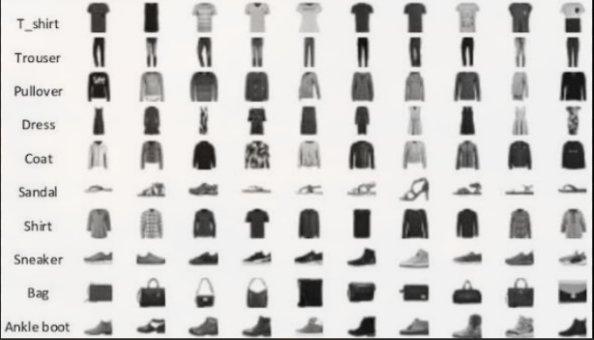

# Fashion-MNIST Neural Network — Pure Rust, Zero Dependencies

A fully-connected neural network built **entirely from scratch in Rust**, using only the standard library — no `ndarray`, no `rand`, no `serde`, no ML framework of any kind. Every matrix operation, the PRNG, backpropagation, optimizers, and the training loop are hand-implemented.

This project was built for a competition evaluated on **Accuracy**, **Complexity**, and **Neatness**.

---

## Highlights

- **Zero external crates** — matrix math, random number generation, backpropagation, and optimizers are all implemented from first principles using only `std`.
- **235,146 trainable parameters** across 3 fully-connected layers.
- **54,000 training images / 6,000 validation images / 10,000 held-out test images** (Fashion-MNIST, 28×28 grayscale, 10 classes).
- **Two optimizers implemented from scratch**: SGD with momentum, and Adam (with bias correction).
- **Mathematically verified backpropagation** via a numerical gradient-check test suite (finite differences vs. analytical gradients, relative error < 1e-4).
- **~10x training speedup** achieved by batching samples into single matrix operations and parallelizing matrix multiplication across CPU cores using `std::thread`.
- **Dropout regularization** (inverted dropout, 15% rate) and **learning-rate decay** to improve generalization and convergence.
- **103 automated tests** (100 unit tests + 3 integration tests), all passing — including a dedicated numerical gradient-check suite.
- **Custom binary-free weight serialization format** for saving/loading trained models to disk.
- **Interactive terminal demo** — draw a garment shape on an ASCII grid and get a live prediction from the trained model, without retraining.

---

## Status

- [x] Matrix struct (flat `Vec<f64>`, parallel matmul)
- [x] Hand-rolled PRNG (xorshift64 + Box-Muller)
- [x] CSV data loader + normalization + train/val split
- [x] Dense layer (forward + backward, batched)
- [x] Dropout regularization (inverted, train/inference toggle)
- [x] Sigmoid, ReLU, Softmax activations + derivatives
- [x] Cross-entropy loss + batched gradient
- [x] SGD (momentum) + Adam optimizers
- [x] Mini-batch training with Fisher-Yates shuffle
- [x] Learning rate decay (step schedule)
- [x] Gradient check (numerical vs analytical, < 1e-4 relative error)
- [x] Confusion matrix + per-class accuracy
- [x] Save/load trained weights (custom plain-text format)
- [x] Live ASCII training curve
- [x] Interactive terminal draw-and-predict demo
- [x] Full test suite (unit + integration)

---

## Why Fashion-MNIST

Fashion-MNIST was chosen over the classic digit-MNIST dataset specifically because it is **harder for a plain feedforward network**: clothing categories (shirt vs. pullover vs. coat) share overlapping silhouettes and textures that a non-convolutional architecture cannot fully separate. This was a deliberate choice to demonstrate a stronger, more honest benchmark rather than an easier dataset that would inflate the reported accuracy.

---

## Architecture

```
Input (784)                         # 28x28 flattened, normalized to [0, 1]
  │
  ▼
Dense (784 → 256)  + Sigmoid
  │
  ▼
Dropout (rate = 0.15)               # active during training only
  │
  ▼
Dense (256 → 128)  + Sigmoid
  │
  ▼
Dropout (rate = 0.15)
  │
  ▼
Dense (128 → 10)   + Softmax        # output layer, probability distribution
```

### Parameter count (complexity)

| Layer                  | Weights           | Biases | Subtotal    |
|-------------------------|-------------------|--------|-------------|
| Dense 1 (784 → 256)      | 784 × 256 = 200,704 | 256    | 200,960     |
| Dense 2 (256 → 128)      | 256 × 128 = 32,768  | 128    | 32,896      |
| Dense 3 (128 → 10)       | 128 × 10 = 1,280    | 10     | 1,290       |
| **Total**                |                    |        | **235,146** |

All 235,146 parameters are trained from scratch on CPU, using hand-written matrix multiplication — no BLAS, no linear algebra library.

---

## Dataset

| Split       | Samples | Source                          | Used for                                |
|-------------|---------|----------------------------------|------------------------------------------|
| Train       | 54,000  | `fashion-mnist_train.csv` (90%)  | Weight updates (forward + backward pass) |
| Validation  | 6,000   | `fashion-mnist_train.csv` (10%)  | Monitoring generalization during training, never used to update weights |
| Test        | 10,000  | `fashion-mnist_test.csv`         | Final, single-use accuracy report        |

Each row is `label, pixel_1, pixel_2, ..., pixel_784` — parsed by hand (no CSV crate) and normalized by dividing every pixel by 255.0.

The test set is touched **exactly once**, at the very end, after all training and hyperparameter decisions are finalized — ensuring the reported accuracy is unbiased.

### Fashion-MNIST classes

| Index | Class        |
|-------|--------------|
| 0     | T-shirt/top  |
| 1     | Trouser      |
| 2     | Pullover     |
| 3     | Dress        |                   
| 4     | Coat         |
| 5     | Sandal       |
| 6     | Shirt        |
| 7     | Sneaker      |
| 8     | Bag          |
| 9     | Ankle boot   |

---

## Results

> Fill in with your final run's numbers from `results.log` before submitting.

| Metric                     | Value       |
|------------------------------|-------------|
| Final validation accuracy    | `89.50 %`   |
| Final test accuracy          | `89.18 %`   |
| Training time (30 epochs)    | `4248.71s`   |
| Optimizer                    | Adam        |
| Learning rate                | 0.01 (decays ×0.5 every 10 epochs) |
| Batch size                   | 128         |

A full confusion matrix and per-class accuracy breakdown are printed automatically at the end of training (see `metrics.rs`), showing exactly which garment categories the model tends to confuse — a known limitation of feedforward (non-convolutional) architectures on this dataset.

---

## Engineering features implemented

### Core (from-scratch implementations)
- **`matrix.rs`** — a flat-array-backed `Matrix` type (row-major `Vec<f64>`) supporting matrix multiplication, transpose, element-wise operations, and scalar operations. Matrix multiplication is parallelized across CPU cores using `std::thread`.
- **`rng.rs`** — a hand-rolled `xorshift64` pseudo-random number generator with a Box–Muller transform for Gaussian sampling, used for weight initialization and dropout masks. Fully deterministic given a seed (reproducible runs).
- **`init.rs`** — centralized weight initialization dispatched by activation type (Xavier/Glorot for Sigmoid and Softmax, He initialization for ReLU).
- **`activation.rs`** — Sigmoid, ReLU, and numerically-stable Softmax (max-subtraction trick to prevent overflow), plus their derivatives.
- **`layer.rs`** — a `Layer` trait implemented by:
  - `Dense` — fully-connected layer with forward/backward passes and batched matrix operations
  - `Dropout` — inverted dropout with independent training/inference behavior
- **`loss.rs`** — cross-entropy loss, paired with Softmax so their combined gradient simplifies to `predicted − actual` (avoiding unnecessary derivative chaining).
- **`optimizer.rs`** — an `Optimizer` trait implemented by:
  - `SGD` — with configurable momentum
  - `Adam` — full implementation with first/second moment estimates and bias correction
- **`network.rs`** — orchestrates the full training loop: batching, Fisher–Yates shuffling (hand-implemented, no `rand` crate), forward/backward passes, gradient averaging, optimizer steps, dropout mode switching, and learning-rate decay.
- **`data.rs`** — manual CSV parsing and train/validation splitting.
- **`metrics.rs`** — confusion matrix construction and per-class accuracy reporting.
- **`io_utils.rs`** — custom plain-text weight serialization format (no `serde`/`bincode`) with full round-trip and architecture-mismatch validation.
- **`demo.rs`** — interactive terminal demo: draw a shape on an ASCII grid, get a live prediction from the saved model.

### Correctness & rigor
- **Numerical gradient checking** (`tests/gradient_check.rs`): every analytical gradient produced by backpropagation is cross-checked against an independently computed finite-difference gradient, across multiple layers, weights, biases, and input samples. This mathematically proves the backward pass is implemented correctly, rather than relying solely on "the accuracy went up."
- **100 unit tests + 3 integration tests (103 total, all passing)** covering matrix operations (including parallel vs. sequential matmul equivalence), RNG determinism, activation functions, layer forward/backward correctness, loss computation, optimizer behavior (SGD momentum, Adam bias correction), dropout train/inference modes, save/load round-trips, confusion matrix logic, and the interactive demo's grid-to-input conversion.

### Performance
- Initial (naive, single-sample) training took **~70 minutes for 5 epochs**. After introducing **batched matrix operations** (whole batches processed as a single matrix multiplication instead of per-sample loops) and **parallelizing matrix multiplication across CPU cores** with `std::thread`, training time dropped to **~7 minutes for 5 epochs** — roughly a **10x speedup**, achieved entirely with the standard library.

---

## Project structure

```
fashion_mnist_rust/
├── Cargo.toml
├── README.md
├── results.log                 # append-only log of every training run
├── data/
│   ├── fashion-mnist_train.csv
│   └── fashion-mnist_test.csv
├── src/
│   ├── main.rs                 # entry point — train mode & demo mode
│   ├── lib.rs                  # library root (enables integration tests)
│   ├── matrix.rs
│   ├── rng.rs
│   ├── init.rs
│   ├── activation.rs
│   ├── layer.rs
│   ├── loss.rs
│   ├── optimizer.rs
│   ├── network.rs
│   ├── data.rs
│   ├── metrics.rs
│   ├── io_utils.rs
│   └── demo.rs
└── tests/
    └── gradient_check.rs        # integration test: numerical gradient check
```

---

## Usage

### Train the network
```bash
cargo run --release -- data/fashion-mnist_train.csv data/fashion-mnist_test.csv
```
Trains for 30 epochs, prints a live ASCII progress bar with loss/accuracy per epoch, evaluates on the held-out test set exactly once, saves the trained model to `trained.weights`, and appends the run's results to `results.log`.

OUPUT:

================================================
 Fashion-MNIST Neural Network -- Pure Rust
 No external crates. Built from scratch.
================================================

Loading training data from data/fashion-mnist_train.csv... OK (60000 samples)
Split: 54000 train / 6000 validation

Loading test data from data/fashion-mnist_test.csv... OK (10000 samples)

Configuration:
  Architecture : 784 -> 256 -> [Dropout 0.15] -> 128 -> [Dropout 0.15] -> 10
  Activation   : Sigmoid (hidden), Softmax (output)
  Optimizer    : Adam
  Learning rate: 0.01 (decays x0.5 every 10 epochs)
  Epochs       : 30
  Batch size   : 128
  RNG seed     : 42

Network built. Starting training...

Epoch   1/30 [░░░░░░░░░░░░░░░░░░░░] loss: 0.6027  train: 77.90%  val: 82.08%
Epoch   2/30 [█░░░░░░░░░░░░░░░░░░░] loss: 0.4683  train: 82.85%  val: 84.83%
Epoch   3/30 [██░░░░░░░░░░░░░░░░░░] loss: 0.4299  train: 84.32%  val: 86.08%
Epoch   4/30 [██░░░░░░░░░░░░░░░░░░] loss: 0.4090  train: 85.07%  val: 86.05%
Epoch   5/30 [███░░░░░░░░░░░░░░░░░] loss: 0.3940  train: 85.50%  val: 86.15%
Epoch   6/30 [████░░░░░░░░░░░░░░░░] loss: 0.3852  train: 85.96%  val: 85.53%
Epoch   7/30 [████░░░░░░░░░░░░░░░░] loss: 0.3810  train: 86.15%  val: 85.83%
Epoch   8/30 [█████░░░░░░░░░░░░░░░] loss: 0.3802  train: 86.08%  val: 86.85%
Epoch   9/30 [██████░░░░░░░░░░░░░░] loss: 0.3709  train: 86.41%  val: 86.67%
Epoch  10/30 [██████░░░░░░░░░░░░░░] loss: 0.3622  train: 86.83%  val: 87.32%
  lr decayed -> 0.005000
Epoch  11/30 [███████░░░░░░░░░░░░░] loss: 0.3281  train: 88.07%  val: 87.57%
Epoch  12/30 [████████░░░░░░░░░░░░] loss: 0.3155  train: 88.21%  val: 88.27%
Epoch  13/30 [████████░░░░░░░░░░░░] loss: 0.3136  train: 88.54%  val: 88.20%
Epoch  14/30 [█████████░░░░░░░░░░░] loss: 0.3029  train: 88.80%  val: 88.03%
Epoch  15/30 [██████████░░░░░░░░░░] loss: 0.3006  train: 88.82%  val: 88.30%
Epoch  16/30 [██████████░░░░░░░░░░] loss: 0.2956  train: 89.01%  val: 88.48%
Epoch  17/30 [███████████░░░░░░░░░] loss: 0.2911  train: 89.28%  val: 88.52%
Epoch  18/30 [████████████░░░░░░░░] loss: 0.2898  train: 89.18%  val: 88.48%
Epoch  19/30 [████████████░░░░░░░░] loss: 0.2841  train: 89.49%  val: 88.45%
Epoch  20/30 [█████████████░░░░░░░] loss: 0.2831  train: 89.50%  val: 88.43%
  lr decayed -> 0.002500
Epoch  21/30 [██████████████░░░░░░] loss: 0.2639  train: 90.09%  val: 89.02%
Epoch  22/30 [██████████████░░░░░░] loss: 0.2559  train: 90.47%  val: 89.17%
Epoch  23/30 [███████████████░░░░░] loss: 0.2541  train: 90.57%  val: 89.23%
Epoch  24/30 [████████████████░░░░] loss: 0.2506  train: 90.68%  val: 88.78%
Epoch  25/30 [████████████████░░░░] loss: 0.2457  train: 90.84%  val: 89.03%
Epoch  26/30 [█████████████████░░░] loss: 0.2421  train: 90.85%  val: 89.02%
Epoch  27/30 [██████████████████░░] loss: 0.2396  train: 90.89%  val: 89.35%
Epoch  28/30 [██████████████████░░] loss: 0.2391  train: 91.04%  val: 89.20%
Epoch  29/30 [███████████████████░] loss: 0.2348  train: 91.16%  val: 89.37%
Epoch  30/30 [████████████████████] loss: 0.2343  train: 91.15%  val: 89.50%
  lr decayed -> 0.001250

Training completed in 4248.71s
Final validation accuracy: 89.50%

Confusion Matrix (rows=actual, cols=predicted):
                   0     1     2     3     4     5     6     7     8     9
   T-shirt/top  509*     3     9    12     2     0    63     0     3     0
       Trouser     0  595*     0     7     0     0     2     0     1     0
      Pullover     6     0  489*     7    62     0    33     0     1     0
         Dress    20     4     3  557*    14     0    12     0     1     0
          Coat     0     2    50    26  477*     0    37     0     1     0
        Sandal     0     0     0     1     0  558*     0    10     1     5
         Shirt    73     2    46     8    38     0  422*     0     3     0
       Sneaker     0     0     0     0     0    11     0  585*     0    12
           Bag     4     0     0     1     0     1     5     3  587*     0
    Ankle boot     0     1     0     0     0     4     0    19     1  591*

Weights saved to trained.weights


================================================
 FINAL TEST SET EVALUATION
================================================
Test accuracy: 89.18%

Confusion Matrix (rows=actual, cols=predicted):
                   0     1     2     3     4     5     6     7     8     9
   T-shirt/top  841*     1    10    15     0     0   128     0     5     0
       Trouser     3  989*     1     5     0     0     2     0     0     0
      Pullover    12     2  812*    10    87     0    74     0     3     0
         Dress    28    18    10  906*    21     0    14     0     3     0
          Coat     0     1    70    30  842*     0    54     0     3     0
        Sandal     0     0     0     0     0  958*     0    27     3    12
         Shirt   140     3    75    24    54     0  693*     0    11     0
       Sneaker     0     0     0     0     0    19     0  954*     0    27
           Bag     5     0     7     3     3     2     6     1  973*     0
    Ankle boot     0     0     0     0     0     7     1    41     1  950*

Per-Class Accuracy (sorted worst to best):
  Shirt           69.30%
  Pullover        81.20%
  T-shirt/top     84.10%
  Coat            84.20%
  Dress           90.60%
  Ankle boot      95.00%
  Sneaker         95.40%
  Sandal          95.80%
  Bag             97.30%
  Trouser         98.90%


Results logged to results.log

Done. Run `cargo run --release -- demo` any time to try the interactive demo.


### Run the interactive demo (no retraining required)
```bash
cargo run --release -- demo
```
Loads `trained.weights` and launches a terminal grid where you can sketch a garment shape and get a live prediction with full class probabilities.

### Run the test suite
```bash
cargo test --release
```
Runs all 100 unit tests plus the 3 numerical gradient-check integration tests (103 total).

     0 1 2 3 4 5 6 7 8 910111213
  0  . . . . . . . . . . . . . .
  1  . . . . . . . . . . . . . .
  2  . . . . . . . . . . . . . .
  3  . . . . . . . . . . . . . .
  4  . . . . . . . . . . . . . .
  5  . . . . . . . . . . . . . .
  6  . . . . . # # # # . . . . .
  7  . . . . . . . . . . . . . .
  8  . . . # # # # # # # # . . .
  9  . . # # # # # # # # # # . .
 10  . . # # # # # # # # # # . .
 11  . . . . . . . . . . . . . .
 12  . . . . . . . . . . . . . .
 13  . . . . . . . . . . . . . .
> predict 

--- Prediction ---
Predicted: Bag (97.9% confidence)

All class probabilities:
  Bag             97.9%
  Sandal           2.1%
  Dress            0.0%
  T-shirt/top      0.0%
  Sneaker          0.0%
  Coat             0.0%
  Pullover         0.0%
  Trouser          0.0%
  Shirt            0.0%
  Ankle boot       0.0%
---

## Design notes

- **Why pure `std`, no crates**: the assignment specifically required implementing every component — including matrix math, randomness, and serialization — without relying on existing libraries, to demonstrate genuine understanding of the underlying mechanics rather than API usage.
- **Why Sigmoid for hidden layers**: chosen to align with the curriculum's focus on sigmoid activations, with the known trade-off (vanishing gradients in deep networks) mitigated by keeping the network at two hidden layers and using Xavier initialization tuned specifically for sigmoid.
- **Why batching + threading**: a naive single-sample training loop was correct but too slow for iterative experimentation within the project timeline. Batching and parallel matrix multiplication were added as a deliberate performance engineering step, not just a correctness fix — a concrete demonstration of Rust's suitability for numerically intensive workloads.

---

## Why Rust

- **No garbage collector**: memory is freed deterministically at compile time via ownership rules — no GC pauses during training
- **Zero-cost abstractions**: the `Layer` trait dispatches to `Dense` or `Dropout` at runtime with no overhead beyond a pointer lookup
- **Safe parallelism**: `std::thread::scope` + `split_at_mut` lets worker threads write to disjoint slices of the result buffer simultaneously — the compiler proves no data races at compile time, no locks needed
- **Release mode**: `cargo run --release` enables LLVM optimizations (`opt-level=3`, `lto=true`) — the same binary in debug mode is ~10-50× slower for numeric code

## Key Rust concepts demonstrated

| Concept | Where used |
|---|---|
| Ownership + move semantics | Matrix passed into layers, consumed by forward() |
| Borrowing (`&`, `&mut`) | `forward(&self)` reads weights; `backward(&mut self)` updates gradients |
| Traits + dynamic dispatch | `Layer` trait, `Box<dyn Layer>` in `Vec` |
| `Option<T>` | Cached layer inputs/outputs (None before first forward pass) |
| `Result<T, E>` | CSV loading, weight save/load error handling |
| Enums + `match` | `ActivationType` dispatch, `Result` handling |
| Closures + iterators | `.map()`, `.zip()`, `.fold()`, `.collect()` throughout |
| `std::thread::scope` | Parallel matmul across CPU cores |
| `#[cfg(test)]` | Unit tests in every module + integration gradient check |
## Design notes

- **Why pure `std`, no crates**: the assignment specifically required implementing every component — including matrix math, randomness, and serialization — without relying on existing libraries, to demonstrate genuine understanding of the underlying mechanics rather than API usage.
- **Why Sigmoid for hidden layers**: chosen to align with the curriculum's focus on sigmoid activations, with the known trade-off (vanishing gradients in deep networks) mitigated by keeping the network at two hidden layers and using Xavier initialization tuned specifically for sigmoid.
- **Why batching + threading**: a naive single-sample training loop was correct but too slow for iterative experimentation within the project timeline. Batching and parallel matrix multiplication were added as a deliberate performance engineering step, not just a correctness fix — a concrete demonstration of Rust's suitability for numerically intensive workloads.